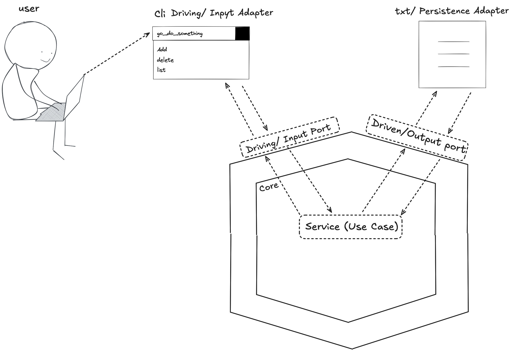

# Go Do Something.


This is a small Go Cli application where I just tried to engrave the **Hexagonal Architecture (aka Ports & Adapters)**  pattern into my brain.It contsist of the...

* A **core domain/service** that knows nothing about I/O or  any frameworks
* A **repository port** (interface) that the core depends on
* **Adapters** for: a newline-delimited textfile as storage, and a simple CLI

The CLI supports:

* `add <value>` — append a line to the file (our advanced DB)
* `list` — print all lines with indices
* `delete-last` — remove the latest (last non-empty) line ( Advaced ey )

---

## Why Hexagonal?

Hexagonal architecture keeps your **business logic independent** of external concerns such as databases, CLIs, HTTP, message buses, etc. 

This helps: 
* **Testability**: Core use cases are tested without booting infrastructure.
* **Swapability**: Replace adapters (e.g., file → SQLite) without touching the core.
* **Longevity**: Your domain logic survives framework churn.

> **Dependency rule:** Source code dependencies always point **inwards** toward the domain. The domain/ports do **not** import adapters.

---

## Project Layout

```
project/
├─ go.mod
├─ cmd/
│  └─ app/
│     └─ main.go            # composition root: wire ports ↔ adapters
├─ internal/
│  ├─ core/
│  │  └─ service.go         # business use cases, imports only ports
│  ├─ port/
│  │  └─ repository.go      # repository interface (the port)
│  └─ adapter/
│     ├─ filedb/
│     │  └─ file_repository.go  # driven adapter; implements Repository
│     └─ cli/
│        └─ runner.go           # driving adapter; user input → core
└─ data.txt  (created at runtime, configurable)
```

### Roles

* **Core** (`internal/core`): Pure application logic (add/list/delete-latest)
* **Port** (`internal/port`): Interfaces the core depends on
* **Adapters** (`internal/adapter/...`):

  * **Driven adapter** (filedb): Implements the port (storage)
  * **Driving adapter** (cli): Parses commands, calls the core
* **Composition root** (`cmd/app/main.go`): Wires dependencies together

---

## Ports & Adapters in this App

### Port (Repository)

```go
// internal/port/repository.go
 type Repository interface {
     Add(value string) error
     List() ([]string, error)
     DeleteLast() error
 }
```

### Driven Adapter (File Repository)

* Persists values as one line per entry in a text file
* Ensures the file exists; creates it if missing
* `DeleteLast` trims trailing empty lines and removes the last non-empty one

### Driving Adapter (CLI)

* Parses commands/flags
* Translates them into calls to the **core service**
* Prints human-friendly output

---

## Data Flow

```
(User) → CLI (driving adapter) → Core Service → Repository Port → File Adapter (driven) → Textfile
                                             ↑                                          ↓
                                        returns data  ←————————————— reads/writes ——————
```

* CLI (outer layer) **depends on** the core
* File adapter **implements** the port required by the core
* Core knows only about the **port**, not the concrete file implementation

---

## Getting Started

### 1) Build

```bash
cd cmd/app
go build -o go_do_something

### 2) Run

```bash
# default file path = ./data.txt (or override via env/flag)
./go_do_something Do add "hello world"
./go_do_something add "second line"
./go_do_something list
./go_do_something delete-last
./go_do_something list

# use a custom file path
go_do_something_File=/tmp/mydb.txt ./go_do_something add "from env"
./go_do_something -file /tmp/mydb.txt list
```

---

## Commands & Behavior

### `add <value>`

* Appends a single line to the file
* Internal newlines in `<value>` are replaced with spaces to keep the storage one-entry-per-line

### `list`

* Prints a 1-based index and the stored value for each line

### `delete-last`

* Removes the last **non-empty** line
* If the file is empty (or has only blanks), returns a friendly error
* Preserves a trailing newline where appropriate (POSIX-friendly files)

---

## Configuration

* `-file <path>`: CLI flag to choose the storage file (default `./data.txt`)
* `GO_DO_SOMETHING_FILE`: Environment variable used by `main.go` if set; CLI flag takes precedence inside the `cli` adapter

> Tip: keep the file in a git-ignored `./var/data.txt` for local dev.

---

## Design Decisions

1. **No external deps**: Pure Go `os`, `bufio`, and `flag` keep the example focused.
2. **Mutex in the file adapter**: Guards concurrent access in the same process. For cross-process concurrency you’d need OS-level file locking (e.g., `flock`) or a real DB.
3. **Separation of concerns**: Input validation is minimal in the CLI; core treats empty strings as a no-op by default (you can change to an error).
4. **Human-friendly storage**: Newline-delimited text keeps it transparent and easy to inspect with shell tools.

---

## Testing Strategy

* **Core (pure)**: Unit test `Service` with a fake repository; no filesystem involved.
* **File adapter**: Test against a temp directory; assert contents after `Add`, `DeleteLast`.
* **CLI**: Table-driven tests by invoking `Run(...)` with argument slices and capturing output.

### Example fake repository for core tests

```go
// test double implementing the port
 type fakeRepo struct { items []string }
 func (f *fakeRepo) Add(v string) error { f.items = append(f.items, v); return nil }
 func (f *fakeRepo) List() ([]string, error) { return append([]string(nil), f.items...), nil }
 func (f *fakeRepo) DeleteLast() error {
     if len(f.items) == 0 { return fmt.Errorf("empty") }
     f.items = f.items[:len(f.items)-1]
     return nil
 }
```

### Run tests

```bash
go test ./...
```

---

## Swapping the Storage Adapter

Replacing the textfile with another datastore requires **only a new adapter** that implements `port.Repository`.

### Example: SQLite skeleton

```go
// internal/adapter/sqlite/sqlite_repository.go
 type SQLiteRepository struct { db *sql.DB }
 func (s *SQLiteRepository) Add(v string) error { /* INSERT ... */ return nil }
 func (s *SQLiteRepository) List() ([]string, error) { /* SELECT ... */ return nil }
 func (s *SQLiteRepository) DeleteLast() error { /* DELETE latest by id */ return nil }
```

Wire it in `cmd/app/main.go` instead of `filedb.New(...)` and keep the **core** untouched.

---

## Error Handling

* Adapters return specific errors (e.g., file not found/create issues); the CLI converts them to user-readable messages and exit codes
* `Run` returns non-zero exit codes on failure (1 for runtime errors, 2 for usage/flag errors)

---

## Security Considerations

* The file adapter writes exactly what it is given (after stripping newlines). If inputs could be untrusted, consider:

  * Validating/escaping values
  * Restricting or sanitizing paths (`-file`)
  * Setting proper file permissions on creation

---

## Performance Notes

* Suitable for small datasets; `delete-last` currently reads all lines to rebuild the file. For very large files, consider using an indexed store or append-only + tombstones.

---

## Troubleshooting

* **"unknown command"**: Run without args to see usage help
* **No output on `list`**: The file may be empty; try `add` first
* **Permission denied**: Ensure the directory for the `-file` path exists and is writable
* **Concurrent usage from multiple processes**: Add OS-level file locking or switch to a DB adapter

---

## FAQ

**Q: Why not let the core import the file adapter?**
A: That would invert the dependency rule and couple business logic to infrastructure.

**Q: Where is the HTTP API?**
A: The CLI is the “driver” here. You can add another driver (HTTP, gRPC) that calls the same core service.

**Q: How do I store timestamps or IDs?**
A: Extend the port with new methods or encode richer
records (CSV/JSON) inside the file adapter without touching the core.

---

## License

MIT (or your preferred license)

---

## At a Glance (Cheatsheet)

```
# Build
cd cmd/app && go build -o go_do_something

# Use default file
./go_do_something add "value"
./go_do_something list
./go_do_something delete-last

# Use a custom file
./go_do_something -file /tmp/db.txt add "foo"
./go_do_something -file /tmp/db.txt list
```
